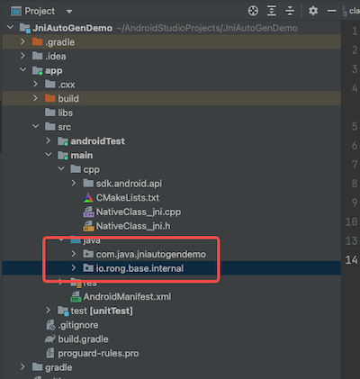
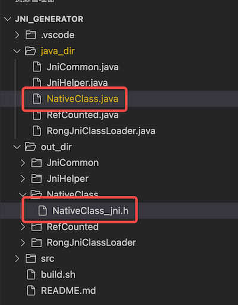
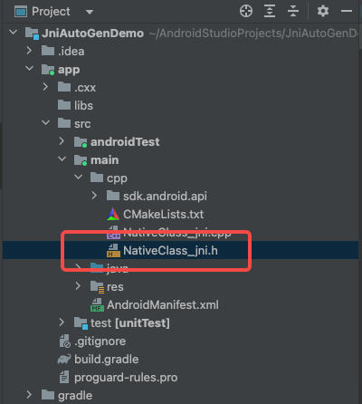

# Jni 自动生成
将使用 WebRTC 的 jni 自动脚本的过程汇总一下，方便以后使用。

# 0. 原理介绍

jni 大致干了如下事情（描述可能不是很准确）

1. 将 Java 类注册到 jni 中 （通过字符串的方式声明类名完整路径）
2. 将 Java 方法注册到 jni 中（通过字符串的方式声明方法完整签名）
3. 实现 jni 的 C++ 方法

一句话总结：本文档的 jni 自动生成是把前两件事情做好，我们只需要专心实现第三步 jni 的 C++ 方法即可

# 1. 环境配置

本章完整描述了所有前期的准备工作

需要用 AS 创建 Native C++ 项目，然后按照本章节进行配置

## 1.1 Demo 代码

`example/` 目录是完整实现功能的 Demo，本文档后续的代码和配置均可在该 Demo 中找到

## 1.2 导入 C++ 代码

`src/cpp/` 是 C++ 代码，放在 Android 项目的 cpp 目录中即可，如截图


## 1.3 导入 Java 代码

`src/java` 是 Java 代码，用来辅助上面的 C++ 代码，放在 java 目录中即可，如截图



## 1.4 配置 CMakeLists.txt

1. 设置 cmake 最低版本
2. 设置 C++ 版本
3. 依赖上面的 C++ 代码

详细见下面的 CMakeLists.txt 

```cmake
# 1. 设置 cmake 最低版本
cmake_minimum_required(VERSION 3.10.2)

project("jniautogendemo")

# 2. 设置 C++ 版本
set(CMAKE_CXX_STANDARD 17)

add_library( 
        jniautogendemo

        SHARED

        NativeClass_jni.h
        NativeClass_jni.cpp
        
        # 3. 依赖目录上面的 C++ 代码
        # jni 自动生成核心代码 开始
        sdk/android/api/jni/class_loader.cc
        sdk/android/api/jni/java_types.cc
        sdk/android/api/jni/jni_common.cc
        sdk/android/api/jni/jni_generator_helper.cc
        sdk/android/api/jni/jni_helpers.cc
        sdk/android/api/jni/jni_onload.cc
        sdk/android/api/jni/jvm.cc
        sdk/android/api/jni/scoped_java_ref_counted.cc
        sdk/android/api/jni/scoped_java_ref.h
        # jni 自动生成核心代码 结束

        )

find_library(
        log-lib
        log)

target_link_libraries(
        jniautogendemo
        ${log-lib})
```

## 1.5 获取 jni 自动生成脚本

`jni_generator_script` 是 jni 自动生成脚本仓库

```java
// jni_generator 目录结构介绍
.
├── java_dir/ // 将 Java 代码放入该路径中
├── out_dir/  // jni 头文件的输出路径
├── src/      // jni 自动生成脚本的源码
├── build.sh  // 编译脚本
└── README.md
```

# 2. 代码开发

Java 层的代码核心分两方面，一是编写通过 Java 调用 Native 的方法，二是编写通过 Native 调用 Java 的方法

C++ 层的代码核心分两方面，一是通过 jni 自动生成脚本把 Java 代码生成 jni 的头文件，二是实现头文件的方法

下面内容按照上述的四个方面分别做详细分析

## 2.1 Java：编写通过 Java 调用 Native  的方法

总的来说比较简单，只有两个规范
1. 所有的 jni 方法需要使用 "native" 声明 
      * 所有手动生成 jni 代码也有这个规定
2. **方法名必须以 "native" 开头**
    * 这个是 jni 生成脚本的控制的，必须遵守

```java
public class Test {
    // 正确，必须用 "native" 修饰，并且方法名以 "native" 开头
    public native void nativeTest()
   
    // 错误，方法名没有以 "native" 开头
    public native void test()
    
    // 错误，没有用 "native" 修饰
    public void nativeTest()
    
    // 错误，没有用 "native" 修饰，方法名没有以 "native" 开头
    public void test1()
}
```

## 2.2 Java：编写通过 Native 调用 Java 的方法

所有被 C++ 调用的 Java 方法需要加 `CalledByNative` 注解

`CalledByNative` 的实现在导入的 Java 代码中

`CalledByNative` 包含一个 String 类型的 value 字段，如下是对 value 字段的详解
1. value 默认为空
    * 为空时会使用和类文件同名的外部类类名 或者 说是 Java 类文件名
2. value 写在内部类时，必须有值，且必须为内部类的类名
    * 普通内部类，value 必须为该普通内部类的类名
    * 内部 Callback，value 必须为该 Callback 的名称
    * 内部 Listener，value 必须为该 Listener 的名称
3. 禁止出现 value 字段和所在类名称不一样的情况
    * 如果出现这个情况，将会生成错误的 jni 方法，调用后会直接崩溃，崩溃原因是找不到对应的 Java 方法

下面的示例代码对 CalledByNative 有各种用例的描述

```java
// Activity.java
// 本段代码仅做功能的介绍，不是完整的代码，不可直接使用
// 可使用的代码见 Demo 中 NativeClass.java
public class Activity {

    // 正确，外部类中注解 value 可以为空，默认值为该外部类名
    @CalledByNative
    public void init() {
    }    
    
    // 正确，普通类中注解 value 明确写成该外部类名
    @CalledByNative("Activity")
    public void init2() {
    }
    
    // 错误，外部类中注解 value 和类名不一致会生成错误的 jni 方法名
    // 调用错误的方法名会崩溃
    @CalledByNative("Fragment")
    public void init3() {
    }
    
    // 内部类
    public class UserInfo{
        // 正确，内部类方法，注解 value 必须有值且必须是内部类名
        @CalledByNative("UserInfo")
        public UserInfo(String uid) {
        }
        
        // 错误，内部类普通方法，注解 value 不能为空
        // value 为空会使用该内部类所在的外部的类名，此处代表 value = "Activity"
        @CalledByNative
        public setUid() {
        }
        
        // 错误，内部类普通方法，注解 value 必须是内部类名
        // value 写错会生成错误的 jni 方法，调用后会导致崩溃
        @CalledByNative("Object")
        public setAge() {
        }
    }
    
    // 内部 Callback 和内部类规范一样
    public interface JniUserInfoCallback {
        // 正确，内部 Callback 方法，注解 value 必须有值且必须是内部 Callback 名
        @CalledByNative("JniUserInfoCallback")
        void onCallback(UserInfo user);
    }
    
    // 内部 Listener 和内部类规范一样
    public interface JniListener {
        // 正确，内部 Listener 方法，注解 value 必须有值且必须是内部 Listener 名
        @CalledByNative("JniListener")
        void onListener(int value);
    }
}
```

## 2.3 C++：生成 jni 头文件

1. 将符合上述两个 Java 规范的 Java 类，直接放入 jni 自动生成脚本仓库的 java_dir 中
2. 在脚本仓库根路径执行 build.sh 
    * build.sh 是个无参的脚本，直接执行即可
    * 执行之后会把 java_dir 中的 Java 文件编译成 jni 的头文件放在 out_dir 中
    * Jni 头文件的规范为 `{Java 类名}_jni.h`
    * 例如 Java 类名为 NativeClass ，那么生成的 jni 头文件为 NativeClass_jni.h
3. 把 out_dir 中生成的 jni 头文件放到 Android 工程的 `cpp` 目录中
    * 注意此处只会生成 jni 的头文件，需要创建 .cpp 文件实现头文件的接口
4. 不要对生成的 jni 头文件进行改动，否则再次生成的头文件会把之前的改动覆盖掉

下面截图是使用 jni 生成脚本用 Java 类生成 jni 头文件



下面截图是把生成 jni 头文件放到 Android 工程的  cpp 目录中



## 2.4 C++：实现 jni 代码

### 2.4.1 Native 调用 Java 的方法

**使用 `CalledByNative` 注解的 Java 方法生成的 C++ 代码是完整的，可直接被 C++ 调用**

生成的 C++ 方法名的规范为 `Java_{注解 value 值}_{Java方法名}`

规范分为三部分
1. 固定以 "Java" 开头，首字母大写
2. 中间的是 注解的 value 值，一般为类名、内部类名、Callback 名、Listener 名 等
3. 最后是注解所在的方法名，构造方法统一为 `Constructor`；其他方法直接使用方法名

如内部类 UserInfo 的构造方法在 C++ 的方法名为 `Java_UserInfo_Constructor`

如内部类 UserInfo 的 setUid 方法在 C++ 的方法名为 `Java_UserInfo_setUid`

### 2.4.2 Java 调用 Native 的方法

使用 "native" 修饰且方法名以 "natvie" 开头的 Java 方法，在 C++ 侧只生成了方法签名，需要做方法的具体实现

生成的 C++ 方法名规范为 `JNI_{注解 value 值}_{去掉 "native" 的 Java 方法名}`

规范分为三部分

1. 固定以 "JNI" 开头，全部大写
2. 中间的是 注解的 value 值，一般为类名、内部类名、Callback 名、Listener 名 等
3. 最后是去掉 "native" 的 Java 方法名
  1. 例如 Java 方法名为 nativeGetInt ，去掉 "native" 之后就是 GetInt 

规范见代码示例对比

```java
// java 层的方法名
public class NativeClass {
    public native int nativeGetInt(int value);
}

// C++ 层对应的方法名
JNI_NativeClass_GetInt
```

创建 cpp 文件，把 jni 头文件中所有满足 C++ 方法名规范的方法声明全都挪到 cpp 文件中

# 3. Jni 实现

本章的所有代码均可以在 Demo 中的 NativeClass_jni.cpp 中找到

其中涉及到大量 base::android:: 的类，本文篇幅有限，暂时不做过多讲解，知道怎么用即可

## 3.1 基本数据类型实现

基本数据类型的转化方式比较固定，以 int 转化为例，后续的基本数据类型就不过多介绍了

复杂数据类型转化会在需要的地方做注释和讲解

### 3.1.1 int 和 int[]

int <> jint

```java
// Java 层代码，详细见 Demo 的 NativeClass.java
public native int nativeGetInt(int value);

// C++ 层代码，详细见 Demo 的 NativeClass_jni.cpp
// int <> jint 
// int 值传入 jni 中会被转化成 jint，可以直接进行加法运算，return jint 到 Java 层会被转化成 int
static jint JNI_NativeClass_GetInt(JNIEnv* env,
       const base::android::JavaParamRef<jobject>& jcaller,jint value) {
    return value + 123;
}

```

int[] <> jintArray

```java
// Java 层代码，详细见 Demo 的 NativeClass.java
public native int[] nativeGetIntArray(int[] value);

// C++ 层代码，详细见 Demo 的 NativeClass_jni.cpp
// int[] <> jintArray ，需要将 jintArray 转化为 ScopedJavaLocalRef 对象 return 出去
static base::android::ScopedJavaLocalRef<jintArray> JNI_NativeClass_GetIntArray(JNIEnv* env,
       const base::android::JavaParamRef<jobject>& jcaller,const base::android::JavaParamRef<jintArray>& value) {
    const jsize length = env->GetArrayLength(value.obj());
    jintArray newArray = env->NewIntArray(length+1);

    jint *oldArr = env->GetIntArrayElements(value.obj(), nullptr);
    jint *newArr = env->GetIntArrayElements(newArray, nullptr);

    for (int i=0;i<length;i++){
        newArr[i] = oldArr[i];
    }
    newArr[length] = 123;

    env->ReleaseIntArrayElements(value.obj(), oldArr, 0);
    env->ReleaseIntArrayElements(newArray, newArr, 0);
    return base::android::ScopedJavaLocalRef<jintArray>(env, newArray);
}
```

### 3.1.2 double 和 double[]

double 处理和 int 类似，double <> jdouble

```java
// Java 层代码，详细见 Demo 的 NativeClass.java
public native double nativeGetDouble(double value);

// C++ 层代码，详细见 Demo 的 NativeClass_jni.cpp
static jdouble JNI_NativeClass_GetDouble(JNIEnv* env,
       const base::android::JavaParamRef<jobject>& jcaller,jdouble value) {
    return value + 1000.0;
}
```

double[] 处理和 int[] 类似，double[] <> jdoubleArray

```java
// Java 层代码，详细见 Demo 的 NativeClass.java
public native double[] nativeGetDoubleArray(double[] value);

// C++ 层代码，详细见 Demo 的 NativeClass_jni.cpp
static base::android::ScopedJavaLocalRef<jdoubleArray> JNI_NativeClass_GetDoubleArray(JNIEnv* env,
       const base::android::JavaParamRef<jobject>& jcaller,const base::android::JavaParamRef<jdoubleArray>& value) {

    const jsize length = env->GetArrayLength(value.obj());
    jdoubleArray newArray = env->NewDoubleArray(length+1);

    jdouble *oldArr = env->GetDoubleArrayElements(value.obj(), nullptr);
    jdouble *newArr = env->GetDoubleArrayElements(newArray, nullptr);

    for (int i=0;i<length;i++){
        newArr[i] = oldArr[i];
    }
    newArr[length] = 987.789;

    env->ReleaseDoubleArrayElements(value.obj(), oldArr, 0);
    env->ReleaseDoubleArrayElements(newArray, newArr, 0);

    return base::android::ScopedJavaLocalRef<jdoubleArray>(env, newArray);
}
```

### 3.1.3 long 和 long[]

long 处理和 int 类似，long <> jlong

```java
// Java 层代码，详细见 Demo 的 NativeClass.java
public native long nativeGetLong(long value);

// C++ 层代码，详细见 Demo 的 NativeClass_jni.cpp
static jlong JNI_NativeClass_GetLong(JNIEnv* env,
       const base::android::JavaParamRef<jobject>& jcaller,jlong value) {
    return value + 100000;
}
```

long[] 处理和 int[] 类似，long[] <> jlongArray

```java
// Java 层代码，详细见 Demo 的 NativeClass.java
public native long[] nativeGetLongArray(long[] value);


// C++ 层代码，详细见 Demo 的 NativeClass_jni.cpp
static base::android::ScopedJavaLocalRef<jlongArray> JNI_NativeClass_GetLongArray(JNIEnv* env,
       const base::android::JavaParamRef<jobject>& jcaller,const base::android::JavaParamRef<jlongArray>& value) {
    const jsize length = env->GetArrayLength(value.obj());
    jlongArray newArray = env->NewLongArray(length+1);

    jlong *oldArr = env->GetLongArrayElements(value.obj(), nullptr);
    jlong *newArr = env->GetLongArrayElements(newArray, nullptr);

    for (int i=0;i<length;i++){
        newArr[i] = oldArr[i];
    }
    newArr[length] = 100000000;

    env->ReleaseLongArrayElements(value.obj(), oldArr, 0);
    env->ReleaseLongArrayElements(newArray, newArr, 0);

    return base::android::ScopedJavaLocalRef<jlongArray>(env, newArray);
}
```

### 3.1.4 boolean 和 boolean[]

boolean 处理和 int 类似，boolean <> jboolean

```java
// Java 层代码，详细见 Demo 的 NativeClass.java
public native boolean nativeGetBoolean(boolean value);

// C++ 层代码，详细见 Demo 的 NativeClass_jni.cpp
static jboolean JNI_NativeClass_GetBoolean(JNIEnv* env,
       const base::android::JavaParamRef<jobject>& jcaller, jboolean value) {
    return !value;
}
```

boolean[] 处理和 int[] 类似，boolean[] <> jbooleanArray

```java
// Java 层代码，详细见 Demo 的 NativeClass.java
public native boolean[] nativeGetBooleanArray(boolean[] value);


// C++ 层代码，详细见 Demo 的 NativeClass_jni.cpp
static base::android::ScopedJavaLocalRef<jbooleanArray> JNI_NativeClass_GetBooleanArray(JNIEnv* env,
       const base::android::JavaParamRef<jobject>& jcaller,const base::android::JavaParamRef<jbooleanArray>& value) {

    const jsize length = env->GetArrayLength(value.obj());
    jbooleanArray newArray = env->NewBooleanArray(length+1);

    jboolean *oldArr = env->GetBooleanArrayElements(value.obj(), nullptr);
    jboolean *newArr = env->GetBooleanArrayElements(newArray, nullptr);

    for (int i=0;i<length;i++){
        newArr[i] = oldArr[i];
    }
    newArr[length] = true;

    env->ReleaseBooleanArrayElements(value.obj(), oldArr, 0);
    env->ReleaseBooleanArrayElements(newArray, newArr, 0);

    return base::android::ScopedJavaLocalRef<jbooleanArray>(env, newArray);
}
```

### 3.1.5 byte 和 byte[]

byte 处理和 int 类似，byte <> jbyte

```java
// Java 层代码，详细见 Demo 的 NativeClass.java
public native byte nativeGetByte(byte value);

// C++ 层代码，详细见 Demo 的 NativeClass_jni.cpp
static jbyte JNI_NativeClass_GetByte(JNIEnv* env,
       const base::android::JavaParamRef<jobject>& jcaller,jbyte value) {
    return value + 1;
}
```

byte[] 处理和 int[] 类似，jbyte[] <> jbyteArray

```java
// Java 层代码，详细见 Demo 的 NativeClass.java
public native byte[] nativeGetByteArray(byte[] value);


// C++ 层代码，详细见 Demo 的 NativeClass_jni.cpp
static base::android::ScopedJavaLocalRef<jbyteArray> JNI_NativeClass_GetByteArray(JNIEnv* env,
       const base::android::JavaParamRef<jobject>& jcaller,const base::android::JavaParamRef<jbyteArray>& value) {
    const jsize length = env->GetArrayLength(value.obj());
    jbyteArray newArray = env->NewByteArray(length+1);

    jbyte *oldArr = env->GetByteArrayElements(value.obj(), nullptr);
    jbyte *newArr = env->GetByteArrayElements(newArray, nullptr);

    for (int i=0;i<length;i++){
        newArr[i] = oldArr[i];
    }
    newArr[length] = 12;

    env->ReleaseByteArrayElements(value.obj(), oldArr, 0);
    env->ReleaseByteArrayElements(newArray, newArr, 0);

    return base::android::ScopedJavaLocalRef<jbyteArray>(env, newArray);
}
```

## 3.2 复杂数据类型实现

### 3.2.1 String 和 String[]

String <> jstring

```java
// Java 层代码，详细见 Demo 的 NativeClass.java
public native String nativeGetString(String value);

// C++ 层代码，详细见 Demo 的 NativeClass_jni.cpp
static base::android::ScopedJavaLocalRef<jstring> JNI_NativeClass_GetString(JNIEnv* env,
       const base::android::JavaParamRef<jobject>& jcaller,const base::android::JavaParamRef<jstring>& value) {
    std::string valueStr = env->GetStringUTFChars(value.obj(), nullptr);
    std::string result = "JNI_NativeClass_GetString_" + valueStr;
    return base::android::ScopedJavaLocalRef<jstring>(env, env->NewStringUTF(result.c_str()));
}
```

String[] <> jobjectArray

```java
// Java 层代码，详细见 Demo 的 NativeClass.java
public native String[] nativeGetStringArray(String[] value);

// C++ 层代码，详细见 Demo 的 NativeClass_jni.cpp
static base::android::ScopedJavaLocalRef<jobjectArray> JNI_NativeClass_GetStringArray(JNIEnv* env,
       const base::android::JavaParamRef<jobject>& jcaller,const base::android::JavaParamRef<jobjectArray>& value) {
    const jsize length = env->GetArrayLength(value.obj());
    jobjectArray newArray = env->NewObjectArray(length+1, env->FindClass("java/lang/String"), nullptr);

    for (int i=0;i<length;i++){
        jstring str = (jstring)env->GetObjectArrayElement(value.obj(), i);
        env->SetObjectArrayElement(newArray, i, str);
    }

    jstring str = env->NewStringUTF("JNI_NativeClass_GetStringArray");
    env->SetObjectArrayElement(newArray, length, str);
    return base::android::ScopedJavaLocalRef<jobjectArray>(env, newArray);
}
```


### 3.2.2 UserInfo 和 UserInfo[]  (本质是 Object 和 Object[])

UserInfo <> jobject

```java
// Java 层代码，详细见 Demo 的 NativeClass.java
public native UserInfo nativeGetUserInfo(String uid);

// C++ 层代码，详细见 Demo 的 NativeClass_jni.cpp
static base::android::ScopedJavaLocalRef<jobject> JNI_NativeClass_GetUserInfo(JNIEnv* env,
       const base::android::JavaParamRef<jobject>& jcaller,const base::android::JavaParamRef<jstring>& uid) {
    std::string str = "C++name";
    jstring jStr = env->NewStringUTF(str.c_str());
    base::android::JavaParamRef<jstring> nameStr(jStr);
    
    // 通过 Java_UserInfo_Constructor 手动创建 Java 的 UserInfo 对象
    base::android::ScopedJavaLocalRef<jobject> user = Java_UserInfo_Constructor(env);
    
    // 通过 Java_UserInfo_setUid 设置 UserInfo 对象的 set 方法
    Java_UserInfo_setUid(env, user, uid);
    Java_UserInfo_setName(env, user, nameStr);
    Java_UserInfo_setAge(env, user, 18);
    return user;
}
```

UserInfo[] <> jobjectArray

```java
// Java 层代码，详细见 Demo 的 NativeClass.java
public native UserInfo[] nativeGetUserInfoArray(UserInfo[] value);


// C++ 层代码，详细见 Demo 的 NativeClass_jni.cpp
static base::android::ScopedJavaLocalRef<jobjectArray> JNI_NativeClass_GetUserInfoArray(JNIEnv* env,
       const base::android::JavaParamRef<jobject>& jcaller,const base::android::JavaParamRef<jobjectArray>& value) {
    const jsize length = env->GetArrayLength(value.obj());
    jobjectArray newArray = env->NewObjectArray(length+1, env->FindClass("com/java/jniautogendemo/NativeClass$UserInfo"), nullptr);

    for (int i=0;i<length;i++){
        jobject obj = (jobject)env->GetObjectArrayElement(value.obj(), i);
        env->SetObjectArrayElement(newArray, i, obj);
    }

    std::string uidString = "uidString";
    jstring jUidString = env->NewStringUTF(uidString.c_str());
    base::android::JavaParamRef<jstring> uidStrRef(jUidString);

    std::string nameString = "C++name2143";
    jstring jNameString = env->NewStringUTF(nameString.c_str());
    base::android::JavaParamRef<jstring> nameStrRef(jNameString);

    base::android::ScopedJavaLocalRef<jobject> user = Java_UserInfo_Constructor(env);
    Java_UserInfo_setUid(env, user, uidStrRef);
    Java_UserInfo_setName(env, user, nameStrRef);
    Java_UserInfo_setAge(env, user, 29);

    env->SetObjectArrayElement(newArray, length, user.obj());

    return base::android::ScopedJavaLocalRef<jobjectArray>(env, newArray);
}
```

### 3.2.3 List<Object> 和 HashMap<String,String>

List<Object>  <> jobject

```java
// Java 层代码，详细见 Demo 的 NativeClass.java
public native List<UserInfo> nativeGetUserInfoArrayList();

// C++ 层代码，详细见 Demo 的 NativeClass_jni.cpp
static base::android::ScopedJavaLocalRef<jobject> JNI_NativeClass_GetUserInfoArrayList(JNIEnv* env,
       const base::android::JavaParamRef<jobject>& jcaller) {
    base::android::ScopedJavaLocalRef<jobject> user = Java_UserInfo_Constructor(env);

    std::string uidString = "uidStr";
    jstring jUidString = env->NewStringUTF(uidString.c_str());
    base::android::JavaParamRef<jstring> uidStrRef(jUidString);

    std::string nameString = "C++nameawefafds";
    jstring jNameString = env->NewStringUTF(nameString.c_str());
    base::android::JavaParamRef<jstring> nameStrRef(jNameString);

    Java_UserInfo_setUid(env, user, uidStrRef);
    Java_UserInfo_setName(env, user, nameStrRef);
    Java_UserInfo_setAge(env, user, 55);

    // 通过 JavaListBuilder 来创建 Java 的 ArraList 对象
    RongCloud::jni::JavaListBuilder builder = RongCloud::jni::JavaListBuilder(env);
    
    // 通过 JavaListBuilder 的 add 方法往 ArrayList 中增加元素
    builder.add(user);

    return builder.java_list();
}
```

HashMap<String,String> <> jobject

```java
// Java 层代码，详细见 Demo 的 NativeClass.java
public native HashMap<String,String> nativeGetHashMap();


// C++ 层代码，详细见 Demo 的 NativeClass_jni.cpp
static base::android::ScopedJavaLocalRef<jobject> JNI_NativeClass_GetHashMap(JNIEnv* env,
       const base::android::JavaParamRef<jobject>& jcaller) {
    // 通过 JavaMapBuilder 来创建 Java 的 HashMap 对象
    RongCloud::jni::JavaMapBuilder builder = RongCloud::jni::JavaMapBuilder(env);

    std::string keyString = "keyStr";
    jstring jKeyString = env->NewStringUTF(keyString.c_str());
    base::android::JavaParamRef<jstring> keyStrRef(jKeyString);

    std::string valueString = "valueStr";
    jstring jValueString = env->NewStringUTF(valueString.c_str());
    base::android::JavaParamRef<jstring> valueStrRef(jValueString);

    // 通过 JavaMapBuilder 的 put 方法往 HashMap 中增加 kv 对
    builder.put(keyStrRef,valueStrRef);

    return builder.GetJavaMap();
}
```

### 3.2.4 Callback

Callback <> jobject

```java
// Java 层代码，详细见 Demo 的 NativeClass.java
public interface JniUserInfoCallback {
    @CalledByNative("JniUserInfoCallback")
    void onCallback(UserInfo user);
}
public native void nativeFetchUserInfo(String uid, JniUserInfoCallback callback);


// C++ 层代码，详细见 Demo 的 NativeClass_jni.cpp
static void JNI_NativeClass_FetchUserInfo(JNIEnv* env,
       const base::android::JavaParamRef<jobject>& jcaller,
       const base::android::JavaParamRef<jstring>& uid,
       const base::android::JavaParamRef<jobject>& callback) {
    if (callback.is_null()) {
        return;
    }
    
    base::android::ScopedJavaLocalRef<jobject> user = Java_UserInfo_Constructor(env);
    Java_UserInfo_setUid(env, user, uid);
    std::string str = "C++nameFetchUserInfo";
    jstring jStr = env->NewStringUTF(str.c_str());
    base::android::JavaParamRef<jstring> nameStr(jStr);
    Java_UserInfo_setName(env, user, nameStr);
    Java_UserInfo_setAge(env, user, 47);
    
    // 通过 Java_JniUserInfoCallback_onCallback 调用 Java 层 JniUserInfoCallback 的 onCallback
    Java_JniUserInfoCallback_onCallback(env,callback, user);
}
```

### 3.2.5 Listener

Listener <> jobject

```java
// Java 层代码，详细见 Demo 的 NativeClass.java
public interface JniListener {
    @CalledByNative("JniListener")
    void onListener(int value);
}

public native void nativeSetListener(JniListener listener);

public native void nativeCallListener();


// C++ 层代码，详细见 Demo 的 NativeClass_jni.cpp

// 声明全局的 Listener
static jobject g_Listener = nullptr;
static void JNI_NativeClass_SetListener(JNIEnv* env,
       const base::android::JavaParamRef<jobject>& jcaller,
       const base::android::JavaParamRef<jobject>& listener) {
    if (listener.is_null()) {
        return;
    }
    // 把 Listener 声明成全局的，如果没做这一步会出现崩溃，看现有的 RongIMLib.cpp 中也有这个代码
    g_Listener = env->NewGlobalRef(listener.obj());
}

static void JNI_NativeClass_CallListener(JNIEnv* env,
       const base::android::JavaParamRef<jobject>& jcaller) {
    // 将 Listener 从全局的 jobject 转化为 JavaParamRef
    const base::android::JavaParamRef<jobject> listener = base::android::JavaParamRef<jobject>(env, g_Listener);

    // 通过 Java_JniListener_onListener 触发 Java 层 JniListener 的 onListener 方法
    Java_JniListener_onListener(env, listener,456);
}
```